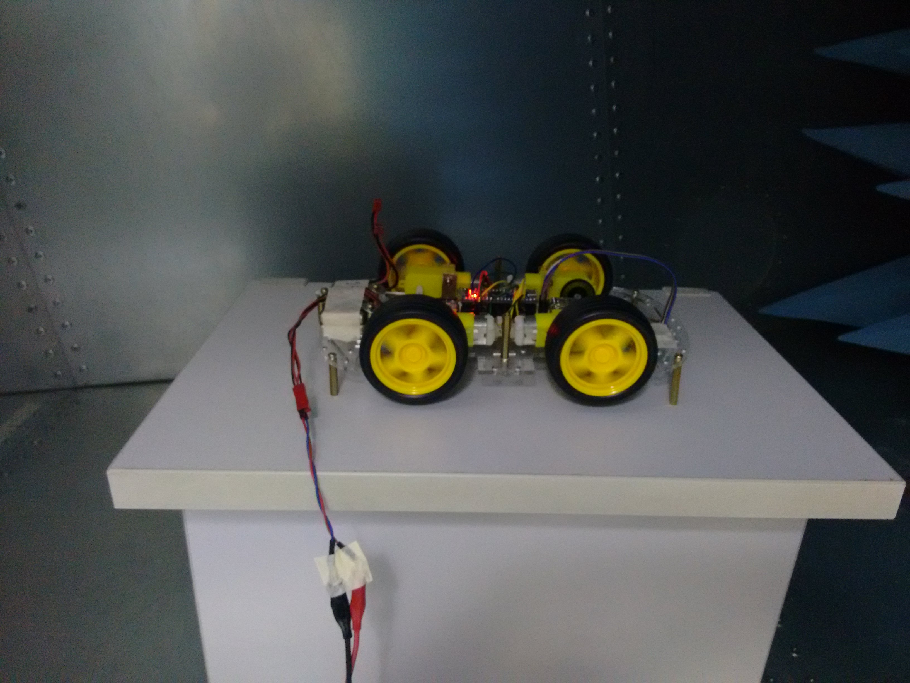

# EUT

---
# Teste de emissão de ruído **conduzido**

## R LOAD - Fonte Linear:

## R LOAD - Fonte Linear - Fan ON:

## CAR LOAD - Fonte Linear:

## R LOAD - Fonte Chaveada - Motorola Super Charger:

## R LOAD - Fonte Linear - Inova:

## CAR LOAD - Fonte Linear - Inova:

---
# Teste de emissão de ruído **irradiado**

