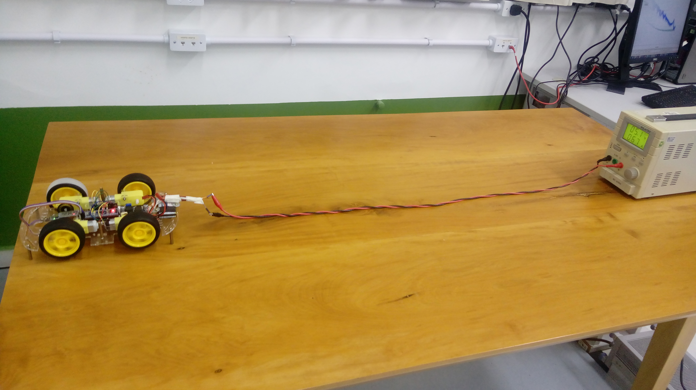

# EUT

---
# Teste de emissão de ruído **conduzido**

## R LOAD - Fonte Linear:

## R LOAD - Fonte Linear - Fan ON:

## CAR LOAD - Fonte Linear:

## R LOAD - Fonte Chaveada - Motorola Super Charger:

## R LOAD - Fonte Chaveada - Inova:

## CAR LOAD - Fonte Chaveada - Inova:

---
# Teste de emissão de ruído **irradiado**
## Bateria - X - Sem correlação de espaço aberto:

## Fonte Linear - Com correlação de espaço aberto::

## Fonte Linear - XYZ - Com correlação de espaço aberto:

---
# Rastreamento
## Motor tipo 1 (preto) - rotor livre

## Motor tipo 1 (preto) - rotor travado

## Motor tipo 2 (branco) - rotor livre

## Motor tipo 2 (branco) - rotor travado

## buck - rotor livre

## buck - rotor travado

## buck - rotor livre

## buck - rotor travado

## cristal do MCU

## MCU

